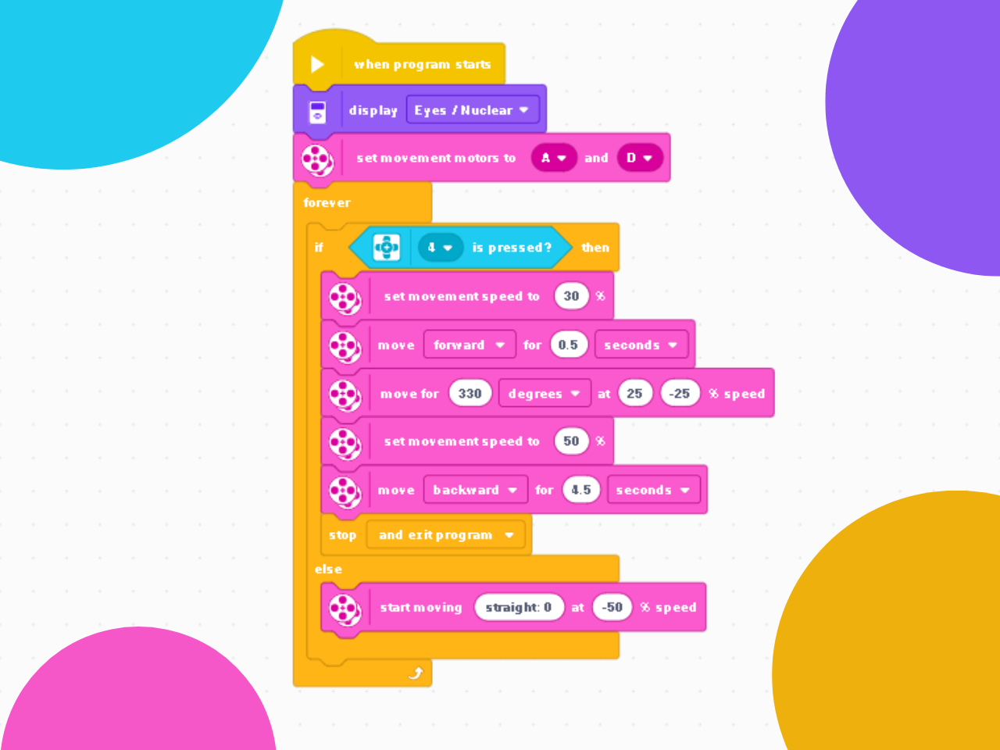

# 🤖 Bump and Return
### Creating a robot that moves back and forth using a touch sensor.

---

### 🎯 Objective
To program a robot capable of advancing to the end of a table, detecting a touch via a sensor, and then returning to its starting point.

---

### 🕹️ Challenge Description
Implement a program to control a robot equipped with a touch sensor. The robot must:

* Start at the initial position (the beginning of the table).
* Advance in a straight line until it hits an obstacle at the end of the table.
* When the touch sensor is triggered, the robot must reverse direction and return step-by-step to the initial position.
* Upon returning to the start, the robot should stop and end the program or repeat the cycle.

---

### 💡 Code Logic
The program's logic is based on a loop that continues until the touch sensor is pressed.

1.  **Motor Definition:** The motors are pre-defined before the program initializes.
2.  **Forward Movement until Contact:** In a constant loop, the robot will move in a straight line until the touch sensor is pressed.
3.  **Pivot Turn on Contact:** When the sensor is pressed, the robot will perform a 330-degree turn to return to its origin point.
4.  **Return and Repeat:** The robot returns to its starting point, repeating this cycle as requested by the professor's challenge.

  

---

### 🪧 Notes and Disclaimers
The data and values presented here are specific to my robot and the proposed challenge arena. These values may vary depending on the robot and the environment.

---

### 👨‍💻 Author

Thanks for checking out this project! Great programming logic to all!

* **GitHub:** [LuizMullerSouza](https://github.com/LuizMullerSouza)
* **Instagram:** [@luizmullerz](https://www.instagram.com/luizmullerz/)

Happy coding!