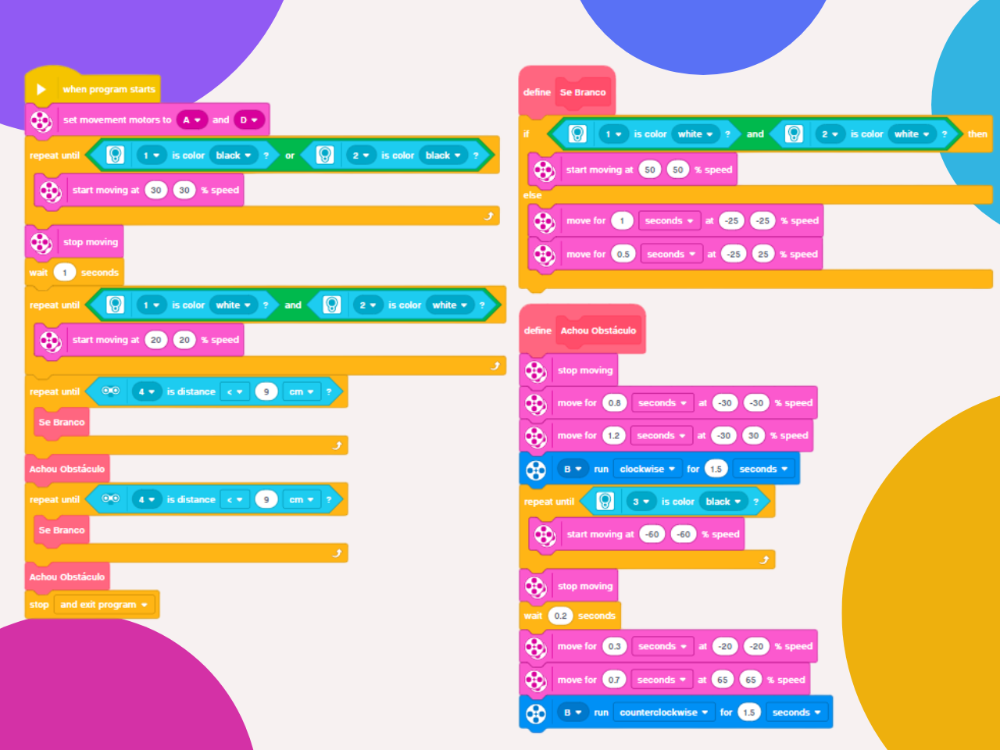

# 🤖 Circular Rescue Mission
### An autonomous robot designed to clear obstacles from a circular arena.

---

### 🎯 Objective
To program a LEGO EV3 robot to detect and remove obstacles placed inside a circle bounded by a black line, pushing them completely out of the area.

---

### 🕹️ Challenge Description

#### Arena:
* White floor.
* A circle with a black line boundary.
* Two cylindrical or cubic obstacles placed randomly inside the circle.

#### Robot:
* LEGO EV3 base with color/light and ultrasonic or touch sensors.
* Must start completely outside the circle.

#### Mission:
* Start outside the circle.
* Enter the circle and detect that it is inside the search area.
* Locate an obstacle and push it until it is completely outside the black line.
* While pushing, the robot must not allow more than 50% of its body to cross the boundary line.
* The robot will push both obstacles and, after detecting that the circle is empty, must end the program.

#### Evaluation Criteria
| Item              | Weight | Details                                                               |
| ----------------- | :----: | --------------------------------------------------------------------- |
| Execution Time    | 4 pts  | 0–1 min = 4 pts; 1–2 min = 3 pts; 2–3 min = 2 pts; >3 min = 1 pt      |
| Precision         | 2 pts  | Does not exceed the black line by 50%.                                |
| Autonomy          | 2 pts  | No human intervention; decisions are 100% programmed.                 |
| Code Efficiency   | 2 pts  | Logical use of sensors, search routines, and course correction.       |

---

### 🏆 Mission Results & Performance
This implementation successfully completed the challenge with a perfect score.

* **Execution Time:** 42 seconds
* **Obstacles Cleared:** 2 out of 2
* **Infractions:** None

---

### 💡 Code Logic
The program's logic is based on a state machine approach, continuing until the ultrasonic sensor has been used twice, ensuring it has removed all obstacles.

1.  **Motor Definition:** The locomotion motors are pre-defined before the program initializes.
2.  **Find Circle Boundary:** Until one of the sensors detects black, the robot will move forward to find the circle.
3.  **Enter Rescue Area:** Upon finding the circle, one sensor will detect black. The robot then moves forward until both sensors detect white, confirming it is now inside the rescue area.
4.  **Initiate Obstacle Search:** The robot begins searching for obstacles using custom My Blocks: `"Se Branco"` and `"Achou Obstáculo"`.
5.  **Search Routine:** The first search routine begins. Until the ultrasonic sensor detects an object closer than 9 centimeters, the robot will execute the `"Se Branco"` My Block.
6.  **Engage and Push Routine:** Upon finding an obstacle, the second routine begins. Until the color sensor detects the black boundary, the robot executes the `"Achou Obstáculo"` My Block.
7.  **"Se Branco" My Block:** If both sensors are white, the robot searches for an obstacle. If not, it means the robot is at the boundary line and must change direction.
8.  **"Achou Obstáculo" My Block:** The robot will perform a reverse turn, open a claw attached to its rear (a claw is not strictly necessary), and push the obstacle backward until the sensor detects the black line, forcing the obstacle out of the arena.
9.  **Boundary Control:** A condition is required to ensure the robot does not cross more than 50% of the boundary line while pushing the obstacle.
10. **Mission Cycle:** This entire search-and-push routine is executed twice.
11. **Program Termination:** The program ends after confirming that two objects have been removed.

  

---

### 🪧 Notes and Disclaimers
The data and values presented here are specific to my robot and the proposed challenge arena. These values may vary depending on the robot and the environment.

---

### 👨‍💻 Author

Thanks for checking out this project! Great programming logic to all!

* **GitHub:** [LuizMullerSouza](https://github.com/LuizMullerSouza)
* **Instagram:** [@luizmullerz](https://www.instagram.com/luizmullerz/)

Happy coding!