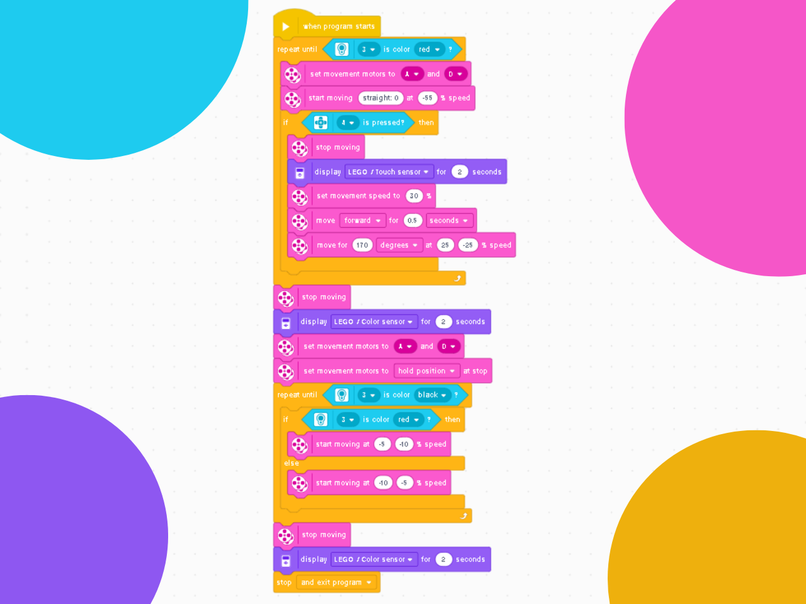

# 🤖 Hybrid Navigation Logic
### Explorer Robot with Sensors and Line Following

---

### 🎯 Objective
To program a robot that moves within a rectangular space, reacting to obstacles and lines on the ground.

---

### 🕹️ Challenge Description
Implement a program to control a robot equipped with an color sensor and a touch sensor. The robot must:

* Start at a designated point within a bounded rectangle.
* Advance in a straight line until it touches an obstacle.
* When the touch sensor is triggered, the robot must reverse its direction and continue its trajectory within the rectangle.
* Constantly monitor the color sensor. Upon detecting a red color on the ground, the robot must initiate a line-following routine, tracking the red line until it finds a black color, where it must stop.

---

### 💡 Code Logic
The program's logic is based on state-switching loops that continue until the color sensor detects the final black line, while also checking for obstacles.

1.  **Motor Definition:** The locomotion motors are pre-defined before the program initializes.
2.  **Search for Red Line:** The robot will remain in a search loop until it finds the red line.
3.  **Obstacle Detection:** Within this loop, a check is performed to see if the touch sensor has been pressed.
4.  **Evasive Maneuver:** If the sensor is pressed, the robot will turn 170 degrees to change its search path.
5.  **Initiate Line Following:** Upon finding the red line, the robot begins the red line-following routine.
6.  **Follow until Black Line:** The robot enters a new loop, following the red line until the black line is found.
7.  **Program Termination:** The program ends upon finding the black line.
8.  **Ignore Black during Search:** During the initial search for the red line, the robot is programmed to ignore any black lines it may cross, ensuring it does not alter its primary search routine.

  

---

### 🪧 Notes and Disclaimers
The data and values presented here are specific to my robot and the proposed challenge arena. These values may vary depending on the robot and the environment.

---

### 👨‍💻 Author

Thanks for checking out this project! Great programming logic to all!

* **GitHub:** [LuizMullerSouza](https://github.com/LuizMullerSouza)
* **Instagram:** [@luizmullerz](https://www.instagram.com/luizmullerz/)

Happy coding!