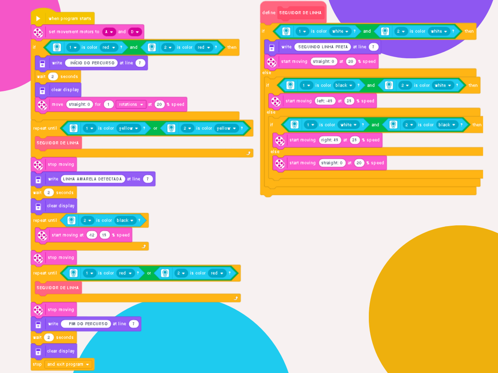

# 🤖 Line Tracking Robot
### EV3 Line Following Robot

---

### 🎯 Objective
To program an EV3 robot to follow a black line on the ground, starting at a red line, turning around at a yellow line, and finishing back at a red line, using a color sensor.

---

### 🕹️ Challenge Description
Implement a program to control a LEGO EV3 robot equipped with a color sensor. The robot must:

* Start on the red line, which marks the starting point.
* Detect and follow the black line to the end of the course.
* Upon detecting the yellow line, it must reverse its direction to return to the red line.
* Stop upon reaching the red line at the finish.
* Throughout the course, the robot must constantly adjust its trajectory to stay on the black line.

---

### 💡 Code Logic
The program logic is based on a primary loop that controls the tracking of all lines.

1.  **Initialization:** The locomotion motors are pre-defined before the program initializes.
2.  **Start Verification:** The robot verifies its starting position by detecting the red line with both sensors, displaying the message "COURSE START".
3.  **Line Following:** Until one of the sensors detects the yellow line, the robot executes the line-following block.
4.  **Turning Maneuver:** Upon finding the yellow line, the robot performs a right turn until the left sensor detects the black line again.
5.  **Return and Stop:** After this, the robot resumes the line-following block until it finds the red line, which is its stop command.

  

---

### 🪧 Notes and Disclaimers
The data and values presented here are specific to my robot and the proposed challenge arena. These values may vary depending on the robot and the environment.

---

### 👨‍💻 Author

Thanks for checking out this project! Great programming logic to all!

* **GitHub:** [LuizMullerSouza](https://github.com/LuizMullerSouza)
* **Instagram:** [@luizmullerz](https://www.instagram.com/luizmullerz/)

Happy coding!