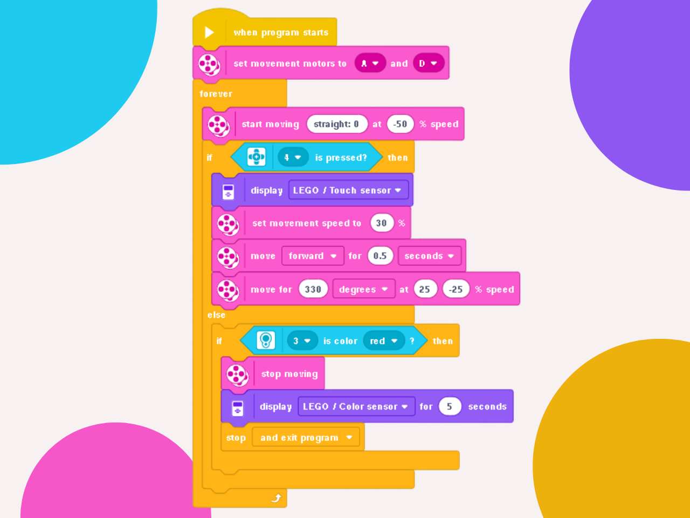

# 🤖 Multi Sensor Navigation
### Rectangular Explorer Robot with Sensors

---

### 🎯 Objective
To program a robot that navigates within a rectangular space, using sensors to make decisions. The robot must react to obstacles and stop upon detecting a red line, adjusting its movements based on sensory input.

---

### 🕹️ Challenge Description
Implement a program to control a robot equipped with a color sensor and a touch sensor. The robot must:

* Start at a designated point within a bounded rectangular space.
* Advance in a straight line until it touches an obstacle.
* When the touch sensor is triggered, the robot must change its direction and continue its trajectory within the rectangle.
* The robot must constantly monitor the color sensor. Upon detecting a red color on the ground, it must stop immediately.

---

### 💡 Code Logic
The program's logic is based on a main loop that continues until the color sensor detects the red line, while simultaneously checking for collisions with the walls.

1.  **Motor Definition:** The locomotion motors are pre-defined before the program initializes.
2.  **Main Search Loop:** The robot enters a repetition loop that continues until the color sensor detects the red line.
3.  **Exploration Behavior:** While the red line is not detected, the robot moves through the arena in search of it.
4.  **Obstacle Evasion:** Since the arena is bounded, the robot may hit a wall. It must recognize this contact via the touch sensor and change its direction to continue exploring.
5.  **Continuous Operation:** As long as the robot does not encounter an obstacle or the red line, it must operate continuously in pursuit of its mission.

  

---

### 🪧 Notes and Disclaimers
The data and values presented here are specific to my robot and the proposed challenge arena. These values may vary depending on the robot and the environment.

---

### 👨‍💻 Author

Thanks for checking out this project! Great programming logic to all!

* **GitHub:** [LuizMullerSouza](https://github.com/LuizMullerSouza)
* **Instagram:** [@luizmullerz](https://www.instagram.com/luizmullerz/)

Happy coding!