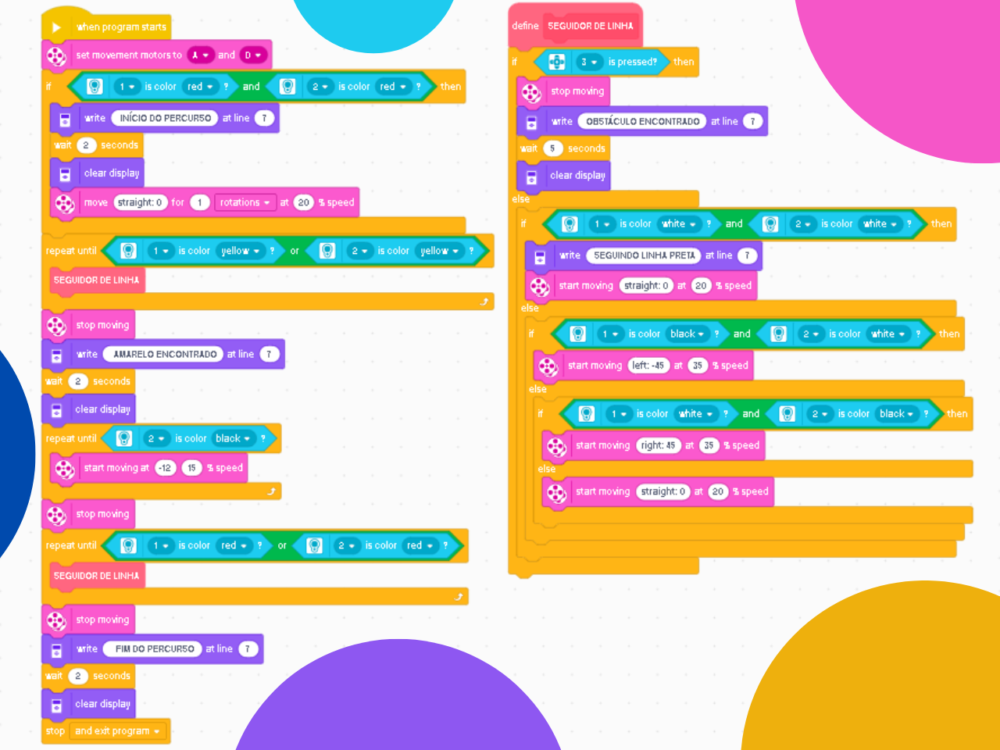

# 🤖 Obstacle Aware Line Follower
### This project was developed for the P1 course exam, achieving a perfect score.

---

### 🎯 Objective
To program an EV3 robot to follow a black line, starting at a red line, turning around at a yellow line, and finishing at the red line. The robot must use a color sensor for line following and a touch sensor to detect obstacles. Upon detecting an obstacle, it must pause for 5 seconds before resuming its task.

---

### 🕹️ Challenge Description
Implement a program to control a LEGO EV3 robot equipped with a color sensor and a touch sensor. The robot must:

* Start on the red line, which marks the starting point.
* Detect and follow the black line until reaching the yellow line.
* Detect obstacles along the path and pause for 5 seconds.
* Upon finding the yellow line, the robot must turn around and follow the black line back to the red line.
* Stop upon reaching the red line at the finish.
* Throughout the course, the robot must constantly adjust its trajectory to stay on the black line.

---

### 💡 Code Logic
The program's logic is based on a primary loop that handles line following, with interrupt conditions for obstacles and turning points.

1.  **Initialization:** The locomotion motors are pre-defined before the program initializes.
2.  **Start Verification:** The robot verifies its starting position by detecting the red line with both sensors, displaying the message "COURSE START".
3.  **Line Following:** Until one of the sensors detects the yellow line, the robot executes the line-following block.
4.  **Obstacle Detection:** Within this block, an obstacle detection condition checks if the touch sensor is pressed. If so, the motors stop for 5 seconds before resuming their activity.
5.  **Turning Maneuver:** Upon finding the yellow line, the robot performs a right turn until the left sensor detects the black line again.
6.  **Return and Stop:** After this, the robot resumes the line-following block until it finds the red line, which is its stop command.

  

---

### 🪧 Notes and Disclaimers
The data and values presented here are specific to my robot and the proposed challenge arena. These values may vary depending on the robot and the environment.

---

### 👨‍💻 Author

Thanks for checking out this project! Great programming logic to all!

* **GitHub:** [LuizMullerSouza](https://github.com/LuizMullerSouza)
* **Instagram:** [@luizmullerz](https://www.instagram.com/luizmullerz/)

Happy coding!