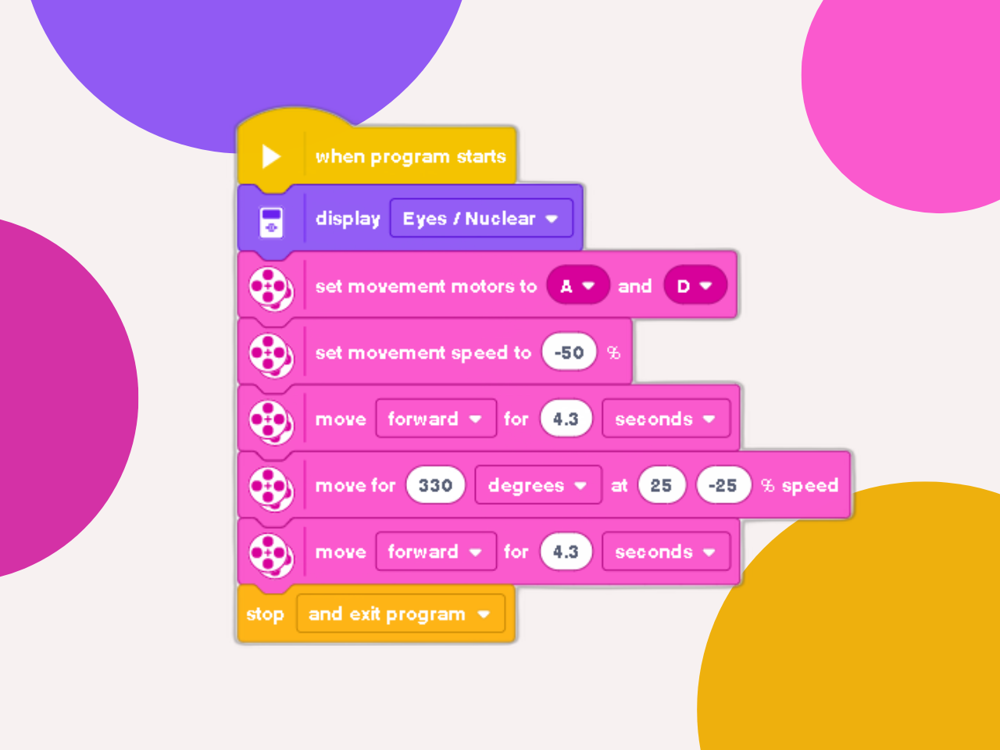

# 🤖 Robot Patrol
### A project about creating a robot that goes back and forth.

---

### 🎯 Objective
To develop the programming logic for controlling a robot that moves to the end of a table and returns to its starting point.

---

### 🕹️ Challenge Description
Implement a program that simulates the movement of a robot on a table. The robot must:

* Start at the initial position (the beginning of the table).
* Advance step-by-step to a defined maximum position.
* Upon reaching the end, reverse direction and return to the initial position.
* End the application.

---

### 💡 Code Logic
The program logic is based on a timed sequence of movements to complete a full patrol cycle.

1.  **Motor and Speed Definition:** The motors for locomotion are defined, and their speed is pre-set.
2.  **Forward Movement:** The robot moves forward for 4.3 seconds to reach the end of the table.
3.  **Pivot Turn:** The motors execute a 330-degree turn to reverse the robot's orientation.
4.  **Return Movement:** The robot moves forward again for the same duration to return to its starting point.

  

---

### 🪧 Notes and Disclaimers
The data and values presented here (like the 4.3-second duration) are specific to my robot and the proposed challenge arena. These values may vary depending on the robot and the environment.

---

### 👨‍💻 Author

Thanks for checking out this project! Great programming logic to all!

* **GitHub:** [LuizMullerSouza](https://github.com/LuizMullerSouza)
* **Instagram:** [@luizmullerz](https://www.instagram.com/luizmullerz/)

Happy coding!