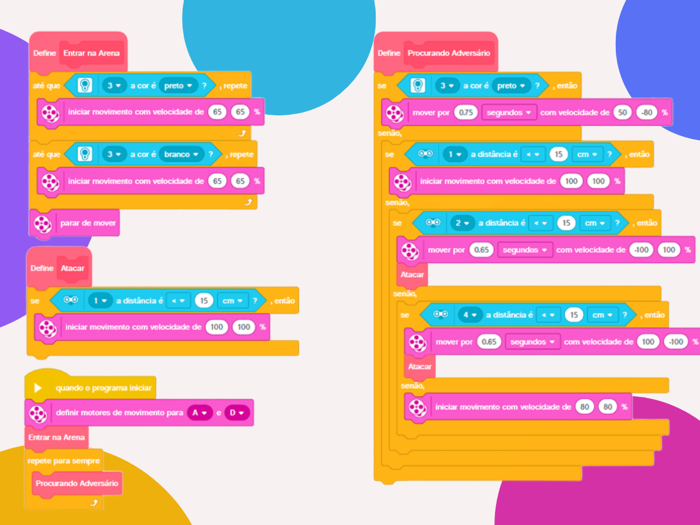

# 🤖 Sumo Robot Challenge
### A competition robot designed to win the sumo challenge.

---

### 🎯 Objective
To build and program a LEGO EV3 robot capable of detecting and pushing an opponent out of a circular sumo arena, using sensors and control logic.

---

### 🕹️ Challenge Description
The goal is to create an autonomous sumo robot that can locate and push an opponent out of a black-bordered circular arena.

#### Recommended Sensors:
* **Color Sensor:** To detect the black edge of the arena.
* **Ultrasonic Sensor:** To detect the opponent.

#### Basic Rules:
* Two robots in the arena at a time.
* The winner is the one who pushes the other completely out of the circle.
* Matches are best of 3 rounds.
* Maximum 2 minutes per fight.

---

### 🏆 Mission Results & Performance
This implementation was a success, resulting in first place in the sumo challenge.

* **Total Fights:** 24 Fights
* **Average Time per Fight:** 37 Seconds
* **Record:** 22 Wins and 2 Draws

---

### 💡 Code Logic
The program's logic is an autonomous state machine based on sensor feedback. Our robot was built and designed to always seek the opponent, wherever they may be. Therefore, this implementation uses three ultrasonic sensors and one color sensor.

1.  **Enter Arena:** The robot starts outside the arena and moves in a straight line until it finds the black line, signifying it has found the arena. After this, the scanning phase begins.
2.  **Search for Opponent:** The robot will continue roaming the arena, always searching for an opponent in front of it.
3.  **Flank Detection:** The robot has one frontal and two side sensors. If any side sensor detects the opponent, a 180-degree turn is executed to face the opponent frontally, thus avoiding a disadvantage in the fight.
4.  **Arena Edge Detection:** During attack mode, the robot keeps its color sensor active. As soon as it detects a black edge, it will reverse and turn in another direction to resume searching for the opponent.
5.  **Repetition:** The robot will remain in this loop indefinitely until the judge declares a victory, loss, or draw.

  

---

### 🪧 Notes and Disclaimers
The data and values presented here are specific to my robot and the proposed challenge arena. These values may vary depending on the robot and the environment.

---

### 👨‍💻 Author

Thanks for checking out this project! Great programming logic to all!

* **GitHub:** [LuizMullerSouza](https://github.com/LuizMullerSouza)
* **Instagram:** [@luizmullerz](https://www.instagram.com/luizmullerz/)

Happy coding!